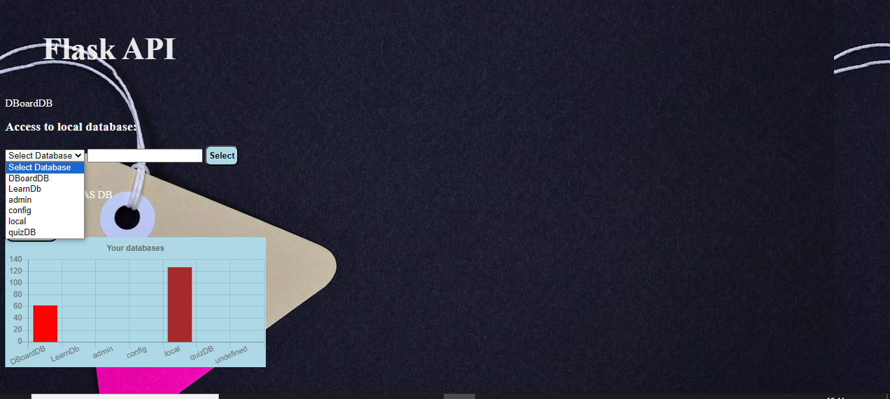

Project keywords: Python Flask, API, JavaScript, Jquery, NoSQL, HTML, MongoDB Cloud Atlas

Python Flask REST API with JavaScript and MongoDB.
The main idea is that you can access multiple mongoDB databases with a single program using api endpoints or an html interface. With the Html user interface, the user can access both local databases and MongoDB Atlas databases.

The username and password are stored in the .env environment file and retrieved with the os.getenv function.
The .env file is in gitignore mode for security reasons

Example view from the front page, where the user can choose the local database or the cloud database they want. Database statistics made with ChartJS are also displayed

Main features

ACCESS TO LOCAL DATABASE USING HTML-UI & OTHER HTML-UI FEATURES.

The program can search for all mongodb databases and their collections on the computer using MongoDB's list_database_names method. After the search, the user can select them for use via the HTML interface.
You can perform CRUD operations on the database you have selected. Selecting a database is easy, select a database from the html dropdown menu and click the Select button.

The connection between the mongo databases and the program is made using the Mongo URI. in this case the Mongo uri starts with mongodb://localhost:27017/(db)/(col).
db and col are the parameters of the database name and the collection, the contents of which are obtained from the user's selections in the drop-down menu.

JQUERY functions facilitate CRUD operations. With this program, you don't need to enter the object ID, just click on it and it will go to the input field. speeds up, for example, the deletion of records from the database. This is made made with jquery click and this methods.

Python and JavaScript collaboration, among others:

The Python function counts the number of fields in the MongoDB collection and the Javascript function creates the same number of input fields (with the createElement method) in the html user interface. the end result is the right number of input fields for adding a new record or editing an old record.

Database statistics, using the JavaScript ChartJS library, this feature displays databases in a bar chart based on their size. Database statistics are obtained from a Python function and delivered to an html page where a JavaScript function grabs the values ​​and makes Bar chart graphs with the values.

The statistical chart works on the hide/show principle. one click shows the chart div, i.e. one click sets the hidden attribute to true and another click sets it to false and the chart div is hidden.

Customization options, in the reading view you can choose whether you want to see the database data in the table, in small or large font, and the background color of the table can also be changed.

Make the text more readable. Normally, MongoDB displays characters like { }, () etc. next to the data.
The checkbox option pretty text removes these characters using a for-loop and a javaScript replace methods

JavaScript search function. The function uses the window.find method and highlights the found words in yellow. the function also stores the searched words in a table and displays them to the user.
The function also shows some statistics about the searched words, for example the number of characters of the longest and shortest words and the number of characters of both words.

ACCESS TO DATABASE IN MONGODB CLOUD ATLAS

On the home page, select the checkbox called Access to the Atlas database. 
After clicking, the program executes a javascript function that dynamically creates a drop-down menu and retrieves the available databases using the list_database_names method.
the databases are placed in a drop-down menu from which the user selects the desired database.

The selected value of the dropdown is obtained by the request.form.get method and stored in a variable that is passed to the Python function that communicates with MongoDB Cloud Atlas.

After selecting a database, click the selection button and the program will go to a new html page, where the available collections are from the drop-down menu. select a collection and click the View button to see the contents of the collection.
The available collections are retrieved using the list_collection_names method

ACCESS THE DATABASE USING API ENDPOINT

using api/db/(name)/(collection) where the parameter (name) is the name of the desired database and (collection) is the name of the desired collection. This will display all the database information on the screen.

DELETE RECORDS USING API ENDPOINT

Deleting a record using the api endpoint is done with the /api/delete/(database)/(collection)/(id) command
this will remove the record whose id it receives as a parameter from the named database's collection.

