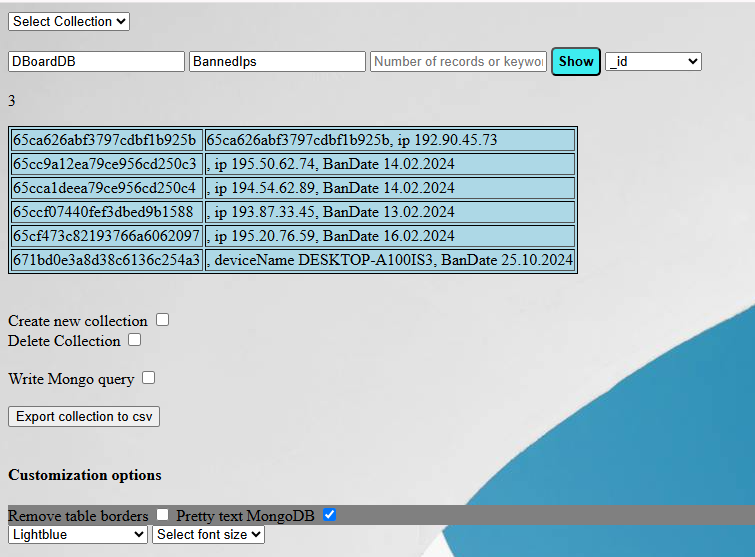
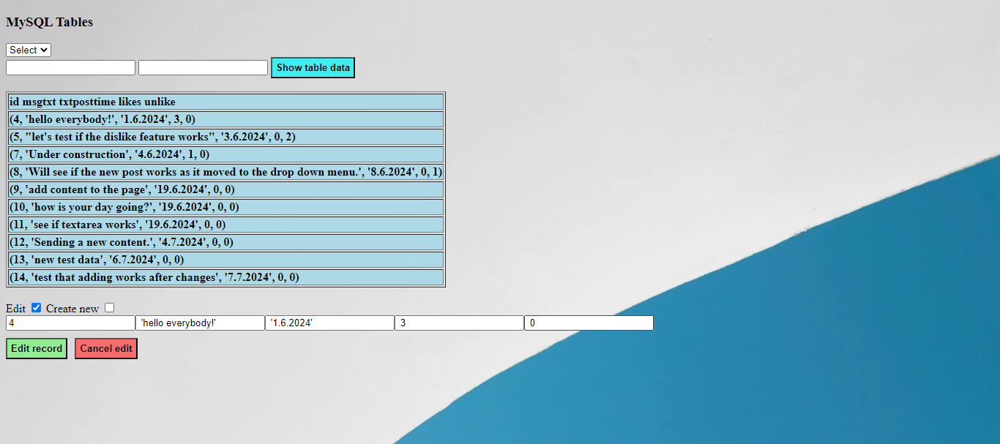

Project keywords: Python Flask, JavaScript, jQuery, NoSQL, MySQL, SQLite, HTML, MongoDB Cloud Atlas

The main idea is that you can access multiple MongoDB, MySQL or SQLite databases with a single program using api endpoints or an html interface. With the Html user interface, the user can access both local databases (MongoDB, MySQL & SQLite) and MongoDB Atlas cloud databases.

It is possible to read, update, add new records and delete records to all the mentioned databases.
You can also create new document collections in Mongo databases and tables and columns in SQL databases.

The Mongo Cloud Atlas username and password are stored in the .env environment file and retrieved with the os.getenv function. The .env file is in gitignore mode for security reasons.

Example view from the front page, where the user can choose the local database or the cloud database they want. Database statistics made with ChartJS are also displayed.

Example view when I select a database named DBoardDB and a BannedIps collection from the database. 
The view also uses customization, the font size is set to medium, the background color of the table is light blue, and extra characters are removed from the database text

Example picture where the data of the MySQL database table is displayed in the table element and the first row of the element is selected for editing. The Jquery function stores the text of the clicked element and adds it to the input field as shown in the image for editing.

The JavaScript function always creates the correct number of html input fields using the for-loop and createElement method. The MySQL table selected in the example image has a total of 5 columns, so editing its records requires the same number of input fields

Example image where the user writes a sql query. The input fields above show the selected sql table and the sql database to be queried.

Example picture where the user writes a mongoDB query, where the search condition is to find documents that mention the word Tommi in the name field.

For the selected MongoDB database, an info row is displayed, which tells the number of collections and records and the size of the database in megabytes.

Example image where the user has limited the number of sqlite database files to be searched to five. The first 5 sqlite files found are displayed in the Table element. The size of the database files is displayed in megabytes using the stats method of the Python OS library.

Sqlite db files can also be searched for in specific folders by typing the path of the folder in the html input field. The folder path entered by the user is displayed in the html button after typing. This feature is made using the onChange event handler and a JavaScript function.

An example picture of a function where the user can enter the desired .db file path in the input field. 
The input field has a predictive text input feature, implemented with Python os.walk & next methods and jQuery's auto-completion function. With the help of the functions, all the main folders of the c-drive are displayed, thus making it easier to write the address path.

MAIN FEATURES

index.html is split into smaller html files using the Python Flask Include method.

ACCESS TO LOCAL MongoDB DATABASE USING HTML-UI.

The program can search for all mongodb databases and their collections on the computer using MongoDB's list_database_names method. After the search, the user can select them for use via the HTML interface.
You can perform CRUD operations on the database you have selected. Selecting a database is easy, select a database from the html dropdown menu and click the Select button.

The connection between the mongo databases and the program is made using the Mongo URI. in this case the Mongo uri starts with mongodb://localhost:27017/(db)/(col).
db and col are the parameters of the database name and the collection, the contents of which are obtained from the user's selections in the drop-down menu.

CREATE A NEW COLLECTION IN THE SELECTED MONGO DATABASE

Creating a collection is started by clicking the "create new collection" checkbox. click calls a JavaScript function that creates an html input field. the name of the new collection is written in the input field and the "create" button is clicked. The name of the database and the name of the new collection are passed to a Python function that communicates with the PyMongo client and creates a new collection.
Once the user has selected a mongo database, it is possible to create new collections in the selected database.

DELETE MONGODB COLLECTION

Deleting a collection from a selected mongo database is quite similar to creating a new collection. The only difference is in the Python function that implements the deletion, which uses the drop method after receiving information from the user interface about the name of the database and the name of the collection to be deleted. A Python function obtains this information using the request.form.get method.

ACCESS TO LOCAL MySQL DATABASE USING HTML-UI

All local mysql databases are fetched with the "show databases" command when the user clicks the "access mysql databases" dialog. the results (i.e. database names) are looped in a for loop and displayed in the html dropdown menu.

ACCESS TO LOCAL SQLITE3 DATABASE USING HTML-UI 

Accessing sqlite databases required a different approach. for now, it's done using the Python OS library's os.walk method. With this method, the Python OS library uses a for loop to search for all files on the C drive that end with the .db identifier. Finally, all found .db files will be displayed on the HTML page.

The search for sqlite files starts when the user clicks the "access sqlite databases" checkbox.
After the click, the JavaScript function creates an input field and a button element. enter the number of db files to search in the input field. Without restrictions, the program will search for all .db files on the c drive, and there may be several of them and they may take a lot of time.

A found sqlite file can be selected by clicking on it. The click calls a jQuery function that passes the path and name of the clicked database file to the python function. This shows all tables from selected database.

You can also search for db files by typing the folder path. for example C:\folderName will search for all db files in that path. This property also uses a for loop and the OS.walk method.

If desired, the user can also enter the path of the db file in the html input field. 
This function also uses predictive text input implemented with jQuery auto-completion and Python Os.Walk & next functions. The Python functions search all the main folders on the C drive, and jQuery's autocomplete recognizes the search terms entered by the user and provides folders that match the search terms.

BACKUP SQLITE DATABASE

User can backup SQLite databases. The backup is made using the iterdumb method and the IO library. The backup file is saved as a .sql file in the program folder.

SELF-WRITING SQL QUERIES

You can also write sql queries yourself by clicking the "write sql query" check box.
the query is written to the textarea element, which is sent to the Python function. The Python function performs a search according to the query and returns the result to the html page.

SELF-WRITING MONGODB QUERIES

Writing mongoDB queries works very similarly to the sql queries above. The main difference is that the user must separate the field name and the search value with a colon. For example, the selected collection has a field called products and the user wants to search if there are oranges in the collection. so the query text is products:orange. The query is sent to a python function, where the split method detects a colon in the query and splits the field name and the searched word into parts, which are passed to the PyMongo search method as a dictionary object.

LIMITING THE SEARCH IN MONGO DATABASES

The user can limit the number of displayed search results by entering the number of displayed records in the input field named with the "number of records" placeholder.
This feature is made using the PyMongo limit method. the limit method receives the values ​​entered by the user as parameter.

BACK TO THE PREVIOUS OR NEXT PAGE

The user can return to the previous page at any time if, for example, he wants to change the displayed collection or database. This functionality is implemented with button elements that receive javascript's history.back method from the onclick event handler.

The next page feature works practically the same way, the only difference is that then the history.forward method is called.

SEARCH BY KEYWORDS

The text search function uses the same input field as the search restriction feature above.
since the search restriction only uses numbers and the text search can use numbers and letters, Python's isdigit method is used here to find out which search type is in use. 
That is, if the input field contains only numbers, the isdigit method returns the value true, otherwise the value false. Both values ​​have their own code blocks that are executed if the condition is met.

Using text search in MongoDB requires a text index with the following structure: 
collection.create_index([(fieldName, 'text')]).

In this program, the field names are obtained using the for loop and the keys method, which take the field names of each collection to the html selection component, from which the user can select the desired field. collection. where to search for text.

The selected component contains an onChange event handler that calls a JavaScript function. The JavaScript function transfers the name of the field selected by the user to a hidden html input field, from which the Python function performing the search retrieves it using the request.form.get method.

Python and JavaScript collaboration, among others:

JQUERY functions facilitate CRUD operations. With this program, you don't need to enter the object ID, just click on it and it will go to the input field. speeds up, for example, the deletion of records from the database. This is made made with jquery click and this methods.

The Python function counts the number of fields in the MongoDB collection and the Javascript function creates the same number of input fields (with the createElement method) in the html user interface. the end result is the right number of input fields for adding a new record or editing an old record.

Database statistics, using the JavaScript ChartJS library, this feature displays databases in a bar chart based on their size. Database statistics are obtained from a Python function and delivered to an html page where a JavaScript function grabs the values ​​and makes Bar chart graphs with the values.

The statistical chart works on the hide/show principle. one click shows the chart div, i.e. one click sets the hidden attribute to true and another click sets it to false and the chart div is hidden.

Customization options, in the reading view you can choose whether you want to see the database data in the table, in small or large font, and the background color of the table can also be changed.

Make the text more readable. Normally, MongoDB displays characters like { }, () etc. next to the data.
The checkbox option pretty text removes these characters using a for-loop and a javaScript replace methods

JavaScript search function. The function uses the window.find method and highlights the found words in yellow. the function also stores the searched words in a table and displays them to the user.
The function also shows some statistics about the searched words, for example the number of characters of the longest and shortest words and the number of characters of both words.

ACCESS TO DATABASE IN MONGODB CLOUD ATLAS

On the home page, select the checkbox called Access to the Atlas database. 
After clicking, the program executes a javascript function that dynamically creates a drop-down menu and retrieves the available databases using the list_database_names method.
the databases are placed in a drop-down menu from which the user selects the desired database.

The selected value of the dropdown is obtained by the request.form.get method and stored in a variable that is passed to the Python function that communicates with MongoDB Cloud Atlas.

After selecting a database, click the selection button and the program will go to a new html page, where the available collections are from the drop-down menu. select a collection and click the View button to see the contents of the collection.
The available collections are retrieved using the list_collection_names method

ACCESS THE DATABASE USING API ENDPOINT

using api/db/(name)/(collection) where the parameter (name) is the name of the desired database and (collection) is the name of the desired collection. This will display all the database information on the screen.

DELETE RECORDS USING API ENDPOINT

Deleting a record using the api endpoint is done with the /api/delete/(database)/(collection)/(id) command
this will remove the record whose id it receives as a parameter from the named database's collection.

